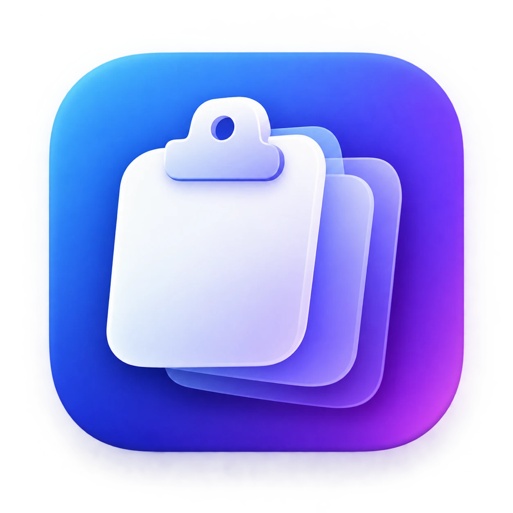
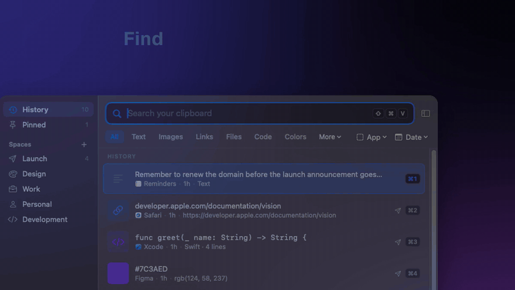
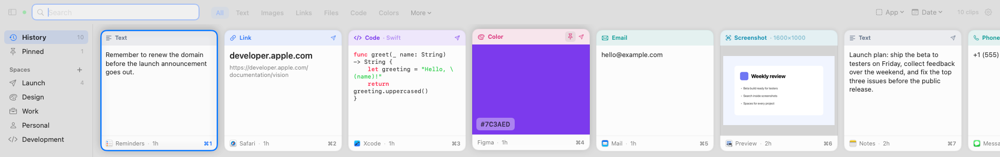
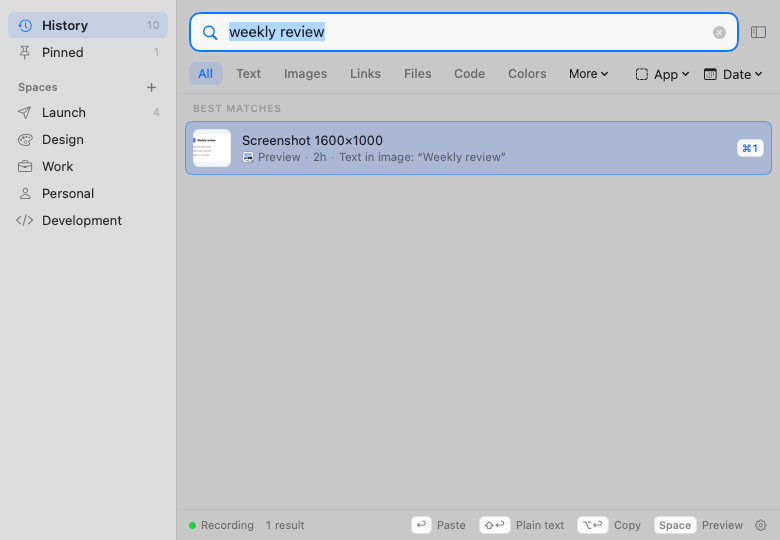
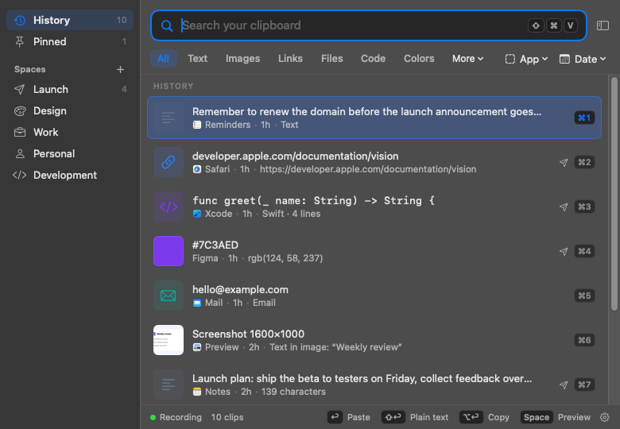
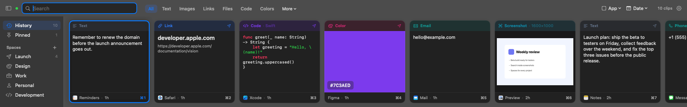
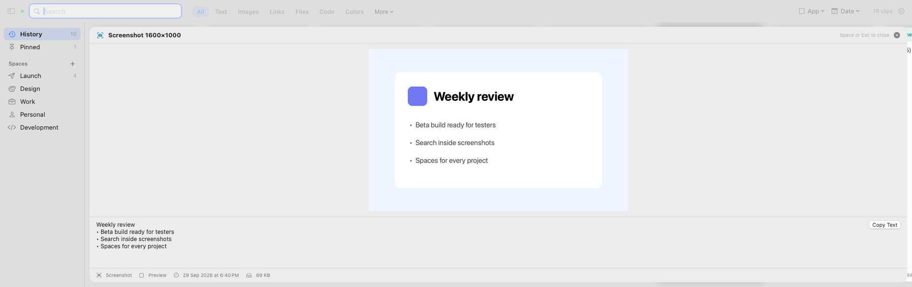
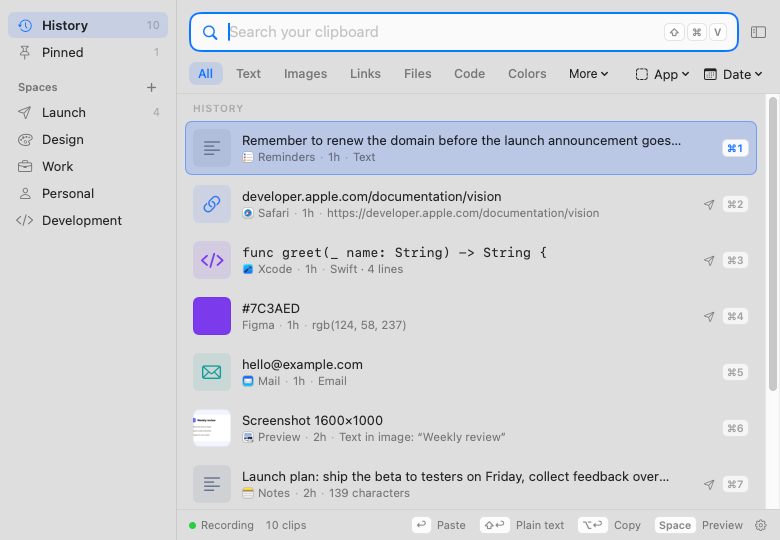

<!--
  Links on this page. Replace the placeholder website URL before the public launch:
    Website                https://clipivo-app.vercel.app  (temporary Vercel address)
    Releases                https://github.com/jishnumahanta/clipivo/releases
-->

<div align="center">



# Clipivo

### Your clipboard remembers.

A native macOS clipboard manager that keeps everything you copy searchable, organized and private, on your Mac.

[](#install)
[](ARCHITECTURE.md)
[](LICENSE)
[](CHANGELOG.md)

**[Download](https://github.com/jishnumahanta/clipivo/releases)** &nbsp;·&nbsp; [Website](https://clipivo-app.vercel.app) &nbsp;·&nbsp; [Features](FEATURES.md)

</div>

<br>

<p align="center">
  
</p>

<p align="center">
  
</p>

## Why Clipivo

You copy something useful, then something else, and the first thing is gone. **Clipivo remembers it**: the text, the link, the screenshot, the color, the file. It finds any of them again in a keystroke, even months later.

- **Keeps everything.** Text, rich text, links, images, screenshots, PDFs, files, colors and code. There's no item limit and no automatic expiry.
- **Finds it instantly.** Search content, titles, file names, source apps, and even the text inside screenshots.
- **Pastes where you are.** Double-click a clip (or press Return) to paste it into the app you were using. You can also paste as plain text or just copy.
- **Stays organized.** Spaces, pins, titles and tags.
- **Stays private.** Everything is stored on your Mac. Clipivo skips the apps you ignore, and it can encrypt sensitive clips behind Touch ID.

<p align="center">
  
  
</p>
<p align="center"><sub>Search inside screenshots · the floating list in dark mode. All screenshots show sample data.</sub></p>

<details>
<summary><b>More screenshots</b></summary>
<br>

<p align="center"><sub>Card shelf, dark mode</sub></p>

<p align="center"><sub>Quick Look, with the text recognised in the image</sub></p>
<p align="center">
  
  
</p>
<p align="center"><sub>Floating list, light · Privacy settings</sub></p>
</details>

## How Clipivo compares

| | **Clipivo** | Typical free / open-source managers | Typical paid managers |
|---|:---:|:---:|:---:|
| History with no item cap or expiry | ✅ | Usually capped at a few hundred items | Varies by plan |
| Keeps rich text, images, files and PDFs | ✅ | Often text and images only | ✅ |
| Search text inside screenshots (on-device) | ✅ | Rare | Some |
| Ranked search with filters (`app:` `type:` `date:`) | ✅ | Basic search | Some |
| Spaces, pins, titles and tags | ✅ | Pins at most | ✅ |
| Card shelf *and* floating list layouts | ✅ | List only | Usually one layout |
| Detects secrets, with a rule per type | ✅ | Password managers only | Varies |
| Encrypted private clips and Touch ID lock | ✅ | Rare | Some |
| No account, no cloud, no analytics | ✅ | ✅ | Often needs an account |
| Source you can inspect | ✅ source available | ✅ | Rarely |
| Sync across devices | Planned | Rare | Often ✅ |

<sub>A general comparison of the categories, not of any specific app; individual apps vary.</sub>

## Private by default

Your history stays in your Mac's user folder. Clipivo has no account, no server and no analytics, and it never writes clipboard contents to logs. Text in images is recognised on-device with Apple Vision. Clipivo doesn't read the clipboard at all while you copy from an ignored app. Password-manager copies and likely secrets follow the rules you choose. By default Clipivo makes no network requests. Two optional features use the network: checking GitHub for updates (daily if you turn it on, or when you click Check Now) and fetching titles for copied links. See [SECURITY.md](SECURITY.md) for details.

## Install

1. Download `Clipivo-<version>.dmg` from [Releases](https://github.com/jishnumahanta/clipivo/releases), open it, and drag **Clipivo** onto **Applications**.
2. Open it. Beta builds aren't notarized yet, so the first time, go to **System Settings › Privacy & Security** and click **Open Anyway**.
3. Allow **Accessibility** so Clipivo can paste for you, then press **⇧⌘V**.

Requires macOS 14 or later (Apple Silicon or Intel). A `.zip` is also available. [INSTALL.md](INSTALL.md) covers updating and uninstalling.

| ⇧⌘V | Return / double-click | ⇧Return | ⌥Return | Space |
|:---:|:---:|:---:|:---:|:---:|
| Open Clipivo | Paste | Paste as plain text | Copy only | Quick Look |

See [all shortcuts](FEATURES.md#keyboard-shortcuts).

## Build from source

```bash
git clone https://github.com/jishnumahanta/clipivo.git && cd clipivo
scripts/build-app.sh && open dist/Clipivo.app
```

This needs Xcode 16 or later. [CONTRIBUTING.md](CONTRIBUTING.md) covers tests, build options and contribution terms, and [ARCHITECTURE.md](ARCHITECTURE.md) explains how it works.

## Status and roadmap

Clipivo is in **beta**: usable every day, still being hardened. Planned next are Developer ID signing and automatic updates, then versions for Windows, iOS and Android, and opt-in end-to-end encrypted sync. None of those exist yet; see [ROADMAP.md](ROADMAP.md).

## License

© 2026 Jishnu Mahanta. All rights reserved.

Clipivo is **source available, not open source**. You may view the code, fork it on GitHub, and build it privately to evaluate it or prepare a contribution. Redistribution, modified builds and commercial reuse require written permission. The Clipivo name, logo and branding are not licensed. See [LICENSE](LICENSE).

Report security issues privately via [SECURITY.md](SECURITY.md).

<sub>Designed and built by [Jishnu Mahanta](https://jishnumahanta.in/go/clipivo).</sub>
